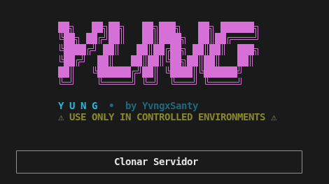

<div align="center">



# 🦇 YUNG CLONE

### ⚡ High-Performance Discord Server Cloner

> A modern, powerful, and interactive Discord server cloning utility built with Python and discord.py

[](https://www.python.org/)
[](https://discordpy.readthedocs.io/)
[](https://github.com/yvngxsanty/Yung-Cloner)
[](LICENSE)

**Fast • Clean • Precise**

<p>
  <a href="#-english">🇺🇸 English</a> •
  <a href="#-español">🇪🇸 Español</a>
</p>

</div>

---

## 📺 Demos & Tutorials

**[Youtube Channel](https://www.youtube.com/@yungxsanty)** ← Pls Suscribe for more!!

---

# 🇺🇸 English

## 📋 Overview

YUNG CLONE is a sophisticated Discord server cloning tool designed for users who need to duplicate server structures. It features a sleek terminal UI and robust capabilities for cloning roles, channels, categories, and permissions.

> ⚠️ **Important**: This tool is for educational purposes and controlled environments only. Self-bots violate Discord's Terms of Service.

## ✨ Features

- 🔄 **Complete Server Cloning**
  - Clone all roles with exact permissions
  - Clone text channels with settings
  - Clone voice channels with bitrate settings
  - Clone categories and channel organization
  - Preserve channel permissions and overwrites

- 🎨 **Modern Terminal Interface**
  - Beautiful ASCII art banner
  - Color-coded output with ANSI colors
  - Interactive menu system
  - Real-time operation logging
  - Success summaries with statistics

- ⚙️ **Smart Features**
  - Permission validation before cloning
  - Rate-limit handling with delays
  - Role hierarchy preservation
  - Detailed error logging
  - Operation timing statistics

## 🚀 Quick Start

### Prerequisites

- Python 3.8 or higher
- discord.py 2.3.2 or higher
- A Discord account with server permissions

### Installation

```bash
# Clone the repository
git clone https://github.com/yvngxsanty/Yung-Cloner.git
cd Yung-Cloner

# Install dependencies
pip install -r requirements.txt
```

### Usage

```bash
# Run the application
python main.py
```

**Step-by-Step Guide:**

1. Select your preferred language (English/Spanish)
2. Enter your Discord account token
3. Choose source and destination servers
4. Review the clone summary
5. Type `CLONE` to confirm
6. Watch the real-time cloning process
7. View the completion summary with statistics

## 🎯 Usage Examples

### List Your Servers
```
1. Start the application: python main.py
2. Select "List Servers" from main menu
3. View all servers with admin status and member count
```

### Clone a Server
```
1. Select "Clone Server" from main menu
2. Choose source server (by number or ID)
3. Choose destination server (by number or ID)
4. Review the summary
5. Type 'CLONE' to confirm
6. Wait for completion
```

## ⚙️ Requirements

```
discord.py>=2.3.2
```

### Permissions Required

The bot needs the following permissions in the destination server:

- `Manage Roles` - To create and modify roles
- `Manage Channels` - To create text/voice channels
- `Manage Server` - To update server settings

## 🐛 Troubleshooting

### "Invalid token" error
- Verify your Discord token is correct
- Ensure your account has proper permissions
- Check for special characters in token

### "Missing permissions in destination server"
- Ensure your account has admin rights in destination
- Check role hierarchy doesn't conflict

### Channels not cloning
- Verify destination has available space
- Check your role is below channels being created
- Ensure rate-limit delays are sufficient

### Slow cloning process
- This is normal due to Discord's rate-limiting
- Rate limits prevent API abuse
- Typical clone takes 5-30 minutes depending on server size

## 📝 Operation Logs

Operation logs are displayed in real-time with status icons:

| Icon | Status |
|------|--------|
| ✓ | Success |
| ✗ | Error |
| ⚠ | Warning |
| ℹ | Info |
| ⟳ | Process |

## 📚 API Documentation

### Main Modules

**`src/ui/ui_manager.py`**
```python
UI.t(key)              # Get translated text
UI.menu()              # Display interactive menus
UI.log()               # Log operations with colors
UI.banner()            # Display ASCII banner
```

**`src/core/clone_bot.py`**
```python
CloneBot.main_menu()           # Main interaction menu
CloneBot.clone_server_menu()   # Cloning interface
CloneBot.clone_guild()         # Execute cloning
```

**`src/core/clone_operations.py`**
```python
clone_roles()          # Copy roles with permissions
clone_channels()       # Copy channels and categories
```

---

# 🇪🇸 Español

## 📋 Descripción General

YUNG CLONE es una herramienta sofisticada para clonar servidores de Discord diseñada para usuarios que necesitan duplicar estructuras de servidores. Cuenta con una interfaz de terminal elegante y capacidades robustas para clonar roles, canales, categorías y permisos.

> ⚠️ **Importante**: Esta herramienta es solo para propósitos educativos y entornos controlados. Los self-bots violan los Términos de Servicio de Discord.

## ✨ Características

- 🔄 **Clonado Completo de Servidores**
  - Clona todos los roles con permisos exactos
  - Clona canales de texto con configuración
  - Clona canales de voz con configuración de bitrate
  - Clona categorías y organización de canales
  - Preserva permisos y sobrescrituras de canales

- 🎨 **Interfaz Moderna de Terminal**
  - Banner ASCII art hermoso
  - Salida con código de colores ANSI
  - Sistema de menú interactivo
  - Registro de operaciones en tiempo real
  - Resúmenes de éxito con estadísticas

- ⚙️ **Características Inteligentes**
  - Validación de permisos antes de clonar
  - Manejo de límites de velocidad con retrasos
  - Preservación de jerarquía de roles
  - Registro detallado de errores
  - Estadísticas de tiempo de operación

## 🚀 Inicio Rápido

### Requisitos Previos

- Python 3.8 o superior
- discord.py 2.3.2 o superior
- Una cuenta de Discord con permisos de servidor

### Instalación

```bash
# Clonar el repositorio
git clone https://github.com/yvngxsanty/Yung-Cloner.git
cd Yung-Cloner

# Instalar dependencias
pip install -r requirements.txt
```

### Uso

```bash
# Ejecutar la aplicación
python main.py
```

**Guía Paso a Paso:**

1. Selecciona tu idioma preferido (Inglés/Español)
2. Ingresa tu token de cuenta de Discord
3. Elige servidores de origen y destino
4. Revisa el resumen del clon
5. Escribe `CLONAR` para confirmar
6. Observa el proceso de clonado en tiempo real
7. Ve el resumen de finalización con estadísticas

## 🎯 Ejemplos de Uso

### Listar Tus Servidores
```
1. Inicia la aplicación: python main.py
2. Selecciona "Listar Servidores" del menú principal
3. Ve todos los servidores con estado de admin y cantidad de miembros
```

### Clonar un Servidor
```
1. Selecciona "Clonar Servidor" del menú principal
2. Elige servidor de origen (por número o ID)
3. Elige servidor de destino (por número o ID)
4. Revisa el resumen
5. Escribe 'CLONAR' para confirmar
6. Espera a que se complete
```

## ⚙️ Requisitos

```
discord.py>=2.3.2
```

### Permisos Requeridos

El bot necesita los siguientes permisos en el servidor de destino:

- `Gestionar Roles` - Para crear y modificar roles
- `Gestionar Canales` - Para crear canales de texto/voz
- `Gestionar Servidor` - Para actualizar la configuración del servidor

## 🐛 Solución de Problemas

### Error "Token inválido"
- Verifica que tu token de Discord sea correcto
- Asegúrate de que tu cuenta tenga permisos adecuados
- Verifica caracteres especiales en el token

### "Permisos faltantes en servidor de destino"
- Asegúrate de tener derechos de admin en el destino
- Verifica que la jerarquía de roles no entre en conflicto

### Los canales no se clonan
- Verifica que el destino tenga espacio disponible
- Comprueba que tu rol esté debajo de los canales que se crean
- Asegúrate de que los retrasos de límite de velocidad sean suficientes

### Proceso de clonado lento
- Esto es normal debido a la limitación de velocidad de Discord
- Los límites de velocidad previenen el abuso de API
- El clonado típico toma 5-30 minutos según el tamaño del servidor

## 📝 Registros de Operación

Los registros de operación se muestran en tiempo real con iconos de estado:

| Icono | Estado |
|-------|--------|
| ✓ | Éxito |
| ✗ | Error |
| ⚠ | Advertencia |
| ℹ | Información |
| ⟳ | Proceso |

## 📚 Documentación API

### Módulos Principales

**`src/ui/ui_manager.py`**
```python
UI.t(key)              # Obtener texto traducido
UI.menu()              # Mostrar menús interactivos
UI.log()               # Registrar operaciones con colores
UI.banner()            # Mostrar banner ASCII
```

**`src/core/clone_bot.py`**
```python
CloneBot.main_menu()           # Menú de interacción principal
CloneBot.clone_server_menu()   # Interfaz de clonado
CloneBot.clone_guild()         # Ejecutar clonado
```

**`src/core/clone_operations.py`**
```python
clone_roles()          # Copiar roles con permisos
clone_channels()       # Copiar canales y categorías
```

---

## 🤝 Contributing

Contributions are welcome! / ¡Las contribuciones son bienvenidas!

1. Fork the repository
2. Create a feature branch: `git checkout -b feature/your-feature`
3. Commit with clear messages: `git commit -m "feat: your feature"`
4. Push to your fork: `git push origin feature/your-feature`
5. Open a Pull Request

---

## 📄 License

This project is licensed under the MIT License - see the [LICENSE](LICENSE) file for details.

---

## ⚖️ Legal Disclaimer

> **Self-bots violate Discord's Terms of Service.** This tool is provided for educational purposes in controlled environments only. The author assumes no responsibility for misuse of this software. Use at your own risk and in compliance with Discord's Terms of Service.

---

## 🔗 Resources

- [Discord.py Documentation](https://discordpy.readthedocs.io/)
- [Discord Developer Portal](https://discord.com/developers/applications)
- [Discord Terms of Service](https://discord.com/terms)
- [GitHub Repository](https://github.com/yvngxsanty/Yung-Cloner)

---

<div align="center">

### 「 夜明けのコード 」

**Created with ❤️ by YvngxSanty**

[GitHub](https://github.com/yvngxsanty) • [YouTube](https://www.youtube.com/@yungxsanty) • [Discord](https://discord.gg/aMVRuYeHFB)

</div>
